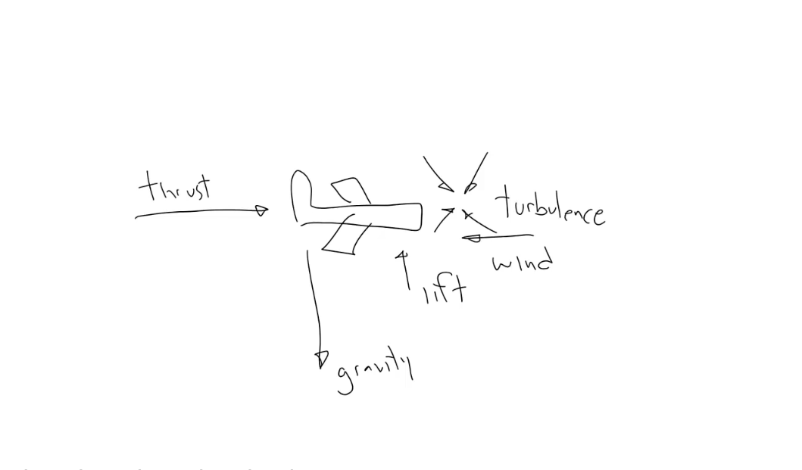

# Advanced Acceleration

Lesson video: https://youtu.be/4UPiT5lDYe8

In the previous lesson we had a mysterious force pulling an object down, but we didn't really specify what this force is. Also all the examples had single unchanging acceleration factor. In real world can be variable and very dynamic. They may turn on and off, change the amount of force they're applying and the direction of the force will likely change when the position or orientation of an object changes.

So in real world we have to not only apply a force, but also specify what this force is.