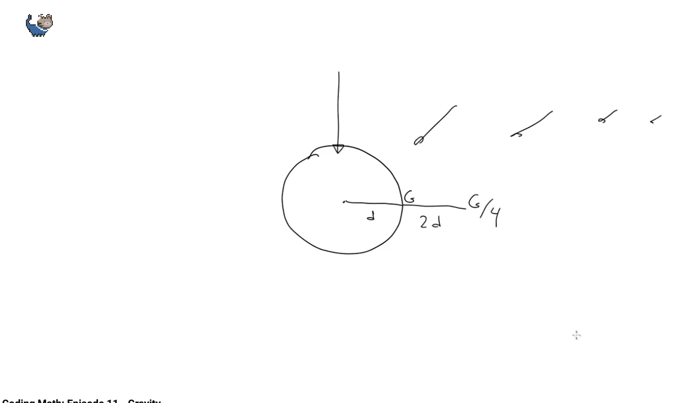
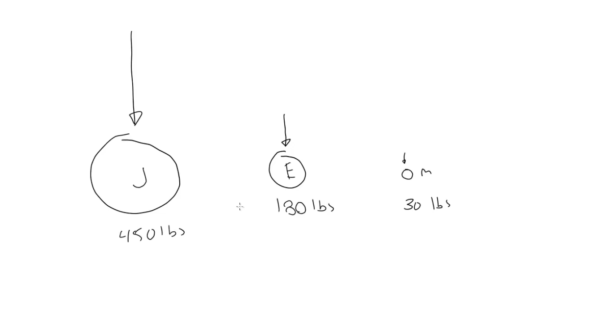
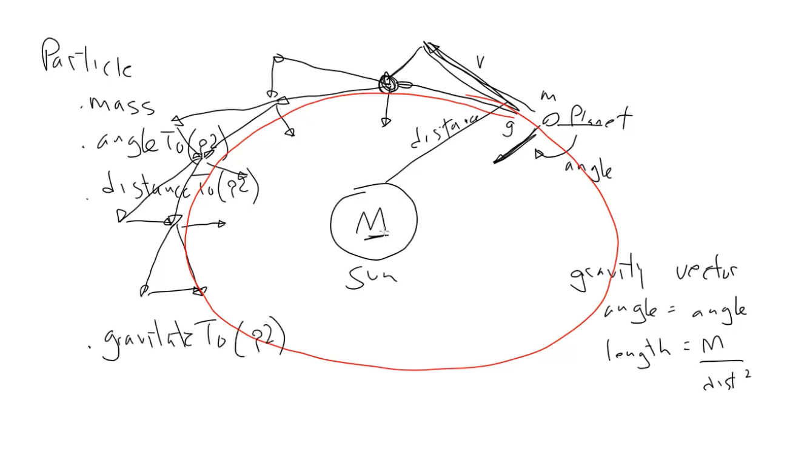

# Gravity

Lesson video: https://youtu.be/EhDtJxX0sCA

Gravity is a force that pulls objects down. We see ourselves as living on a flat surface that we can represent as X axis. So no matter where we go gravity appears to have the same direction and magnitude. But as we pull away we realize that the Earth is actually a sphere and gravity is pulling us not just "down", but towards the center of the Earth. In reality the gravity will have a different angle.

But it's not just direction, magnitude can be different as well. On the surface of the Earth the gravity exerts (оказывает) a certain force, but as you move away from the surface, the force decreases. It's actually inversely proportional to the square of the distance. In other words, if your distance from the center of the Earth is doubled, the gravity you experience would be reduced by 4.



We live on a very narrow region, so from the top of the mountain Everest to the bottom of the dippest ocean, we wouldn't experience any change in the force of gravity.

It gets even more complexted when we realize that not only the Earth has gravity. Actually any body with mass exerts gravity. The force of that gravity is depended on the mass. So a large body will exerts a stronger gravity than a small body.

If our weight on the Earth is 180 pounds, then on the Moon it would be 30 pounds and on Jupiter it would be 450 pounds.



The formula for the acceleration that body has on another body due to the gravity is:
```
gravity = G * M / r²
```

- `G` is gravitational constant
- `M` is the mass of the object doing the pulling (such as the Earth)
- `r` is the distance between the centers of these objects

Now this gravitational constant is technically `6.672 * 10⁸ cm³ g⁻¹ s⁻²`. But unless we're lunching rockets to the Moon, we can throw this whole thing away and say that gravity is:
```
M / r²
```
Again, we're talking about coding games, not scientific simulations or something.

Also, realize that I said any two bodies with mass attract each other. So just as the Earth pulls us down, we also pull the Earth up. But the Earth is so massive that the force is so strong that we don't notice it. In most cases this factor can be ignored, but when we're simulating two bodies of comparable mass, then we would probably have to figure out the gravity both bodies exert on each other.

## Coding

Now, how do we convert all of this into code?

Let's say we have a solar system here, with the Sun and a planet. We can use particles for these. So the Sun has a mass (capital M) and the planet has a mass (small m). This tells us that the particle object needs to have a `mass` property. 

The planet has a velocity and the Sun is exerting a gravity on the planet. The gravity is actually an **acceleration vector** that has an angle and a length. So we just need to add that vector to the planet's velocity on each frame. 

Now we can figure out the angle from the planet to the Sun. For this we can add another useful method to the particle object – `angleTo(p2)`. We already know how to do that from episode 5 (Arctangent), but having a method will make it easier.

This angle will be the angle of the gravity vector. But what will be the magnitude (length)? Well, we just defined gravity is the mass of the attracting object divided by the distance squared (`M / r²`). We have the Sun's mass, only need the distance between the Sun and planet. That will be another useful method – `distanceTo(p2)`. So we can say the length of the gravity vector is `M / distanceTo(p2)²`.

Finally, we can encapsulate this calculations and application of the gravity to the object's velocity into a single method – `gravitateTo(p2)`.


