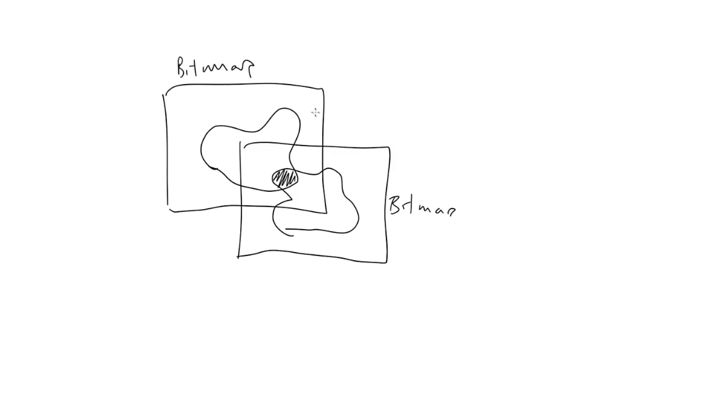

# Collision Detection

Lesson video: https://youtu.be/NZHzgXFKfuY

Basically, collision detection is checking if an object has collided with, or hit, another object.Also known as "hit testing". Collision detection is a broad topic and there's no single technique or method that handles all cases. Often we need to trade off between accuracy and performance.

## Detection methods

Generally speaking, there are two ways to detect collisions:
- Mathematically
- Graphically

Mathematically means that we have some kind of structural definition for each of the objects (some model that describes positions and shapes). So we can do some calculations to see if these two shapes are intersecting.

<figure>
  
  <figcaption>Mathematical detection</figcaption>
</figure>

Graphically means that we actually using the defined screen pixels of each objects to see if they overlap. This usually depends on some kind of built-in bitmaps we're using in a specific system. 

For example, in ActionScript (*is it still a thing?*) there's a BitmapData class that has hitTest method. We can use this to directly compare two bitmaps to see if any of the non-zero pixels overlap, even specify how much transparency they can have and still register a collision. This is very powerful as it allows you to test complex irregular shapes (which is totally impractical to do via mathematical collision detection).

<figure>
  
  <figcaption>Graphical detection</figcaption>
</figure>

Unfortunately, for HTML5 canvas nothing like this has been implemented yet (*the lesson was released in 2014, maybe it has been implemented since then?*). So in this lesson we will stick with mathematical collision detection.

## More about mathematical collision detection

We need some mathematical model of the object we're testing. Objects can have different shapes and it can be described mathematically, but the more complex our object model, the more complicated it is to do collision detection.

So rather that always trying to exactly model an object, first see if we can roughly represent it by one of these three shapes:
- Circle
- Rectangle
- Point

So we will be dealing with 4 types on collisions in this lesson:
- Circle-circle
- Circle-point
- Rectangle-rectangle
- Rectangle-point


### Circle-circle

In the lesson №5 we've covered the Pythagorean theorem and distance. This is vital for this type of collision detection. 

We will define circles as objects having an X, Y and a radius. Say we have two of them and we want to know if they are touching. First we calculate the distance between them (using the Pythagorean theorem). Then we take the radius of each circle and add them together. If the distance between the two circles is more than the sum of the radii, then they are not touching.


And if the distance between the two circles is less than the sum of the radii, then they are touching.

### Circle-point

Almost the same as circle-circle, but we are checking if a point is inside a circle. Point is almost like a circle with a radius of 0. It can be, for example, a mouse cursor.

### Rectangle-point

A rectangle can be defined by two points or by one point plus a width and a height. And in the latter case the width and height are just offsets from the first point to the second. 

We will go with the second option since that's the contention used by several other JS methods.


Say we have a point and we want to know if it's within a rectangle. If so, it will need to satisfy two conditions: 
- The X position of this point must be within the range defined by the X positions of the two points making up the rectangle.
- The Y position must be within the range of the Y positions of those two points.


#### Special case

Let's look at a special case. Say we have XY of 100,100 and the rectangle goes this way with the width of -20 and height of -10. In this case if we have a point inside the rectangle if will not pass the test, as its X is less than rect X and its Y is less than rect Y.

There are few ways to handle this. We can say that width and height must be always positive, but it's kind of arbitrary rule and it's going to make our [pointInRect](../_utils/utils.js) method less useful and more prone to error.

Another solution would be to create a "smart rectangle" object that will automatically adjust its XY values with the width and height, so its XY is always at the top left and the width and height are always positive.

But here we would rather make the [pointInRect](../_utils/utils.js) more robust and that translates into having this [inRange](../_utils/utils.js) method more robust.

```js
inRange: (value, min, max) => {
  return value >= min && value <= max;
},
```

Current code is assuming that min is always less than max. So what we really wanna know is if value >= the smallest value of min and max and value <= the largest value of min and max.

```js
inRange: (value, min, max) => {
  return value >= Math.min(min, max) && value <= Math.max(min, max);
},
```

We're going to fix our [clamp](../_utils/utils.js) method the same way.

> Why is this even needed? Can't we be sure that min and max values will be always in the correct order? Well, when we program games sometimes we may not be sure 
> if the min and max values we pass into functions are truly min and max. So having this Math.min and Math.max checks is a good practice, just to cover such cases.

### Rectangle-rectangle

The left and right X values of a rectangle form a range, with two rectangles we have two X ranges. The same way we have two Y ranges. Now, if the two X ranges overlap each other **and** the two Y ranges overlap too, then rectangles are intersecting.

If either X or Y ranges don't overlap, then rectangles are not intersecting.


How to tell if two ranges overlap? It might be easier to say when they don't overlap.

So if we have two ranges here, A and B. If the max value of A is less than the min value of B, then they don't overlap. For overlap to happen, **max A must be greater than or equal to min B**.


But say we put the range A over here (after B). In this case, if the min value of A is greater than the max value of B, then they don't overlap. So **min of A must be less or equal to max of B**.


So both of these conditions must be met for overlap to happen.

