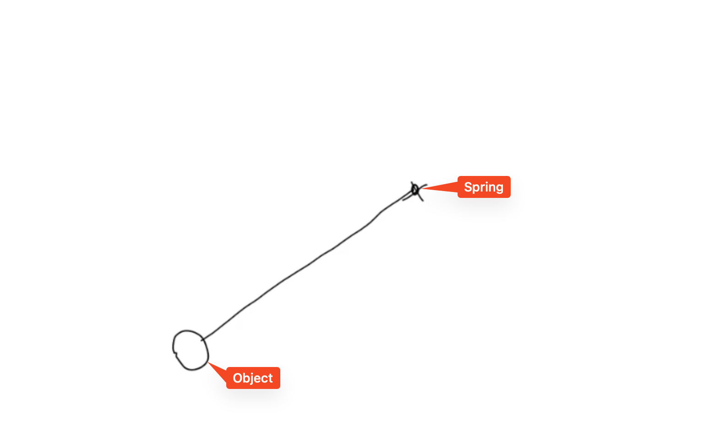
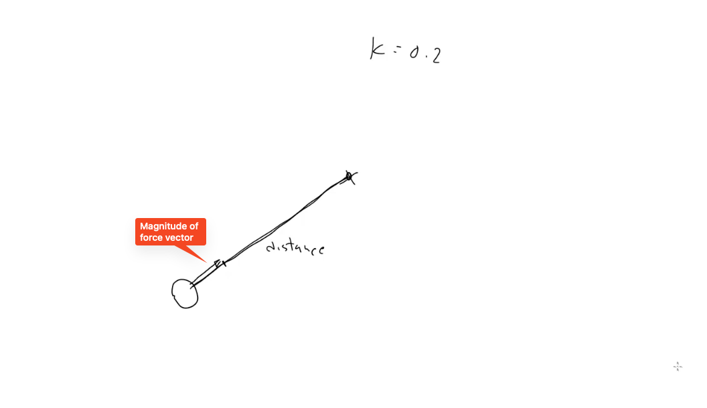
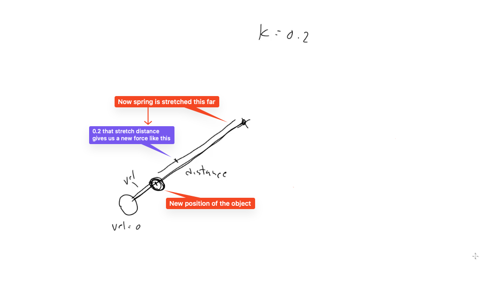
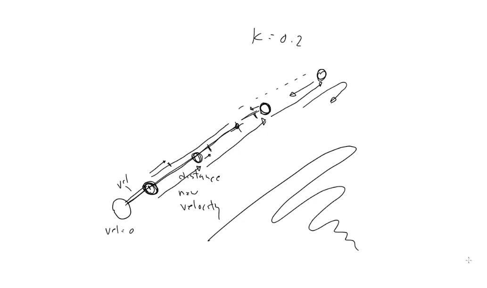
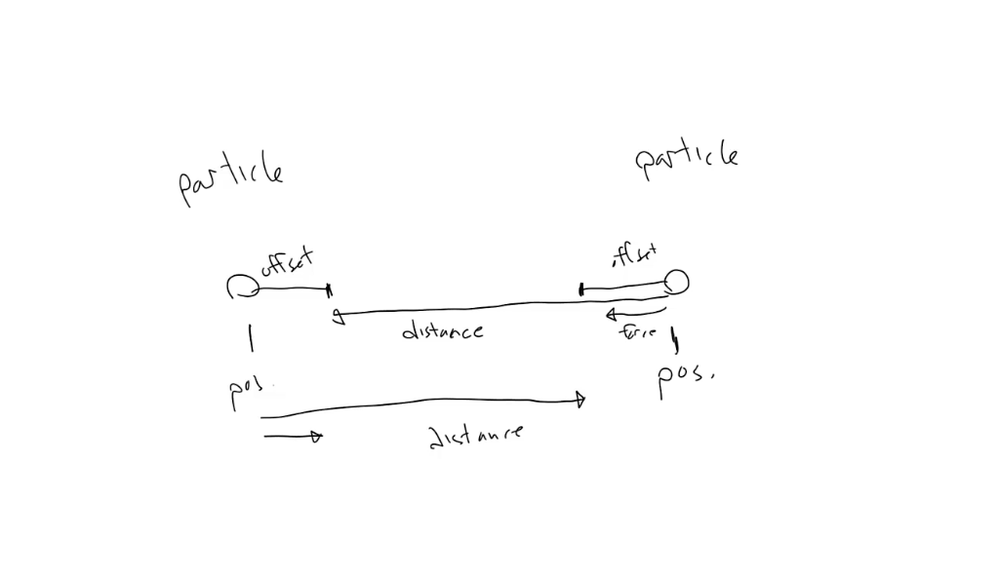

# Springs

Lesson videos:
- https://youtu.be/JywnkK6Iuws
- https://youtu.be/jFG8MzvUTXg

Hooke's law says: "as the extension, so the force". 

This means that the force required to extends or compress a spring a certain distance is proportional to that distance. This also means that the amount of force that spring will then exert to return to its rest state is also proportional to that distance (in other words, the more we stretch the spring, the stronger it will pull back). In real world there are limitations to this – stretch a real spring far enough and it will eventually either bend or break. 

This is kind of the inverse of a force like gravity. With gravity, the further away you get from a massive body the less gravity is exerted. But with springs, the force increases as we move away from the source. It increases linearly – pull a spring out twice as far and we'll experience twice the force.

What's so cool about springs? Soon we will see, that they are easy to code and produce incredibly dynamic, realistic and potentially interactive effects.

## Hooke's law

The formula for Hooke's law is:
```
F = kX
```
- `F` is the resultant force
- `k` is a constant that represents the "stiffness" of the spring
- `X` represents the distance that the spring is stretched

The `k` is usually some smaller fraction like 0.2. The `F` will be an acceleration vector.

## Example

Say we have an object here, that's attached to a spring here.



For the sake of simplicity let's imagine that this spring will shrink to a length of 0, so that if this object comes to rest on this spring, it will be sitting right at the spring's point.

Let's say the constant (`k`) is 0.2. This makes the force applied by the spring 0.2 times the distance. And that's a vector pointing this way (to the spring's point) with a magnitude of something like this.



Assuming that the object's velocity was 0 to start with, after that first frame, this velocity is now the same as this initial force vector. So it moves to here (this length of the vector).

Now the spring is stretched out this far. 0.2 that stretch distance gives us a shorter force vector. That's less than last time, but it's still more acceleration that gets added to the object's velocity.



So the spring is pulling on the object with less force, but it's still pulling, so the object is still speeding up.

Next frame the object moves closer to the source of the spring. So the spring is still pulling on the object, but only with a tiny bit of force. This still increases the velocity, if only very slightly.

Now the object flies so fast that it flies past the source point of the spring and its position now is over that point. The spring is now stretched out in that direction, and it's pulling the object back. It's reducing the speed of the object.

When the object moves further the point of the spring, the spring is pulling much harder on the object, reducing its speed significantly. At one point the object slows down completely and starts moving back in the other direction.

The whole cycle repeats back and forth, until the object finally settles down.



## Spring with length

So far we've been using the spring's point as the resting position of the weight, assuming that spring has length 0. If we want to simulate a spring with a length, that means the weight must rest at some distance from the spring's point. We can achieve this by reducing the distance between the weight and the spring's point by some amount (say 100px), this means reducing the length of the distance vector by 100px.

See [springWithLength](./script.js#L158) example.

## Two objects springing to each other

Let's picture this. 



We have two particles, both of them has positions (vectors) and we can define offset from each position (just like we did with the spring in the last example). So we have one spring to the offset from the another's position, and we have the second one to the offset from the first spring's position. Without the offset the particles would spring directly to each other and settle on a single point, which would be kinda boring. The offset keeps them separated.

See [twoSprings](./script.js#L209) example.
