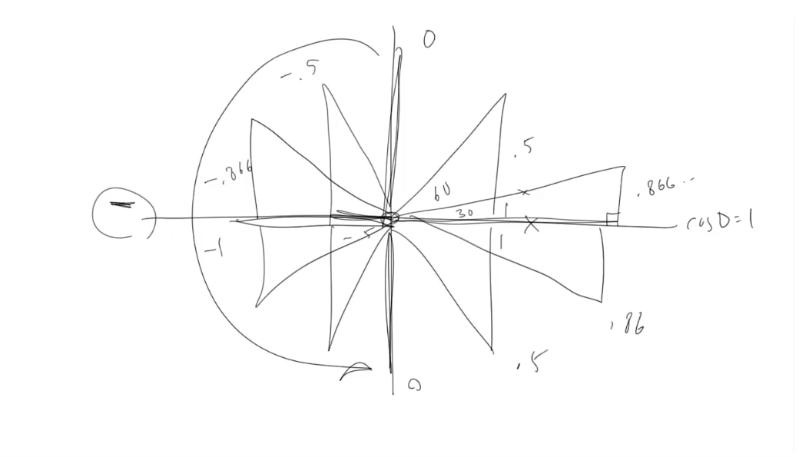
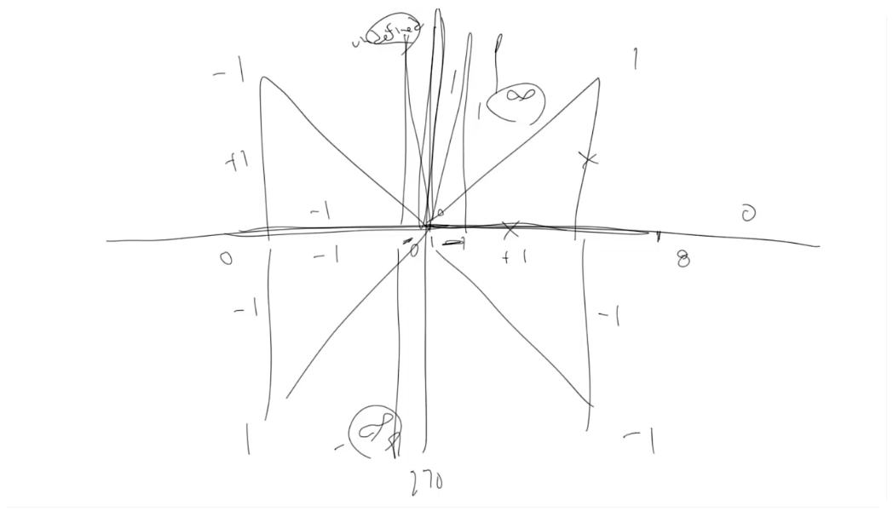

# More Trigonometry

Lesson video: https://youtu.be/-ayh6oEtjbA

## Cosine

Cosine is the ratio of the adjacent side to the hypotenuse.
- For 0 degrees, adjacent equals 1 (to the hypotenuse that equals 1). So cosine(0) = 1.
- For 30 degrees, adjacent equals 0.866. So cosine(30) = 0.866.
- For 60 degrees, adjacent equals 0.5. So cosine(60) = 0.5.
- For 90 degrees, adjacent equals 0. So cosine(90) = 0.
- For 120 degrees, cosine equals -0.5, because it's the negative X direction.
- Etc.

### Cosine Wave

Cosine wave is similar to sine wave, but it starts from 1. It's out of phase from sine wave by 90 degrees.

Cosine wave starts at 1, goes down to 0 (90 degrees), down to -1 (180 degrees), back to 0 (270 degrees) and then back to 1 (360 degrees).

## Tangent

Tangent is the ratio of the opposite side to the adjacent side.
- For 0 degrees, opposite equals 0 and adjacent equals 1. So tangent(0) = 0.
- For 45 degrees, the opposite and adjacent are equal. So tangent(45) = 1.
- When the degree approaches 90, the tangent approaches very small numbers and then Infinity, because the adjacent approaches 0 and the opposite approaches 1.
- For 90 degrees, the tangent is Infinity, because the opposite is 1 and the adjacent is 0 (1 / 0 is undefined).
- For 135 degrees, the opposite is +1 and adjacent is -1. So tangent(135) = -1.
- For 180 degrees, the opposite is 0 and adjacent is -1. So tangent(180) = 0.
- For 225 degrees, the opposite is -1 and adjacent is -1. So tangent(225) = 1.
- For 270 degrees the tangent is -Infinity, because the opposite is -1 and the adjacent is 0 (-1 / 0 is undefined).
- For 315 degrees, the opposite is -1 and adjacent is +1. So tangent(315) = -1.
- For 360 degrees, the opposite is 0 and adjacent is +1. So tangent(360) = 0.

### Tangent Wave

Tangent wave starts at 0, goes to 1 at 45 degrees, goes to Infinity at 90 degrees, then come back in from -Infinity, goes to -1 at 135 degrees and so on.

From programming perspective, dealing with Inifinity or undefined values is not very useful. So tangent is less commonly used than sine and cosine. But in the future lessons we will see a very useful application of the related function – arctangent.