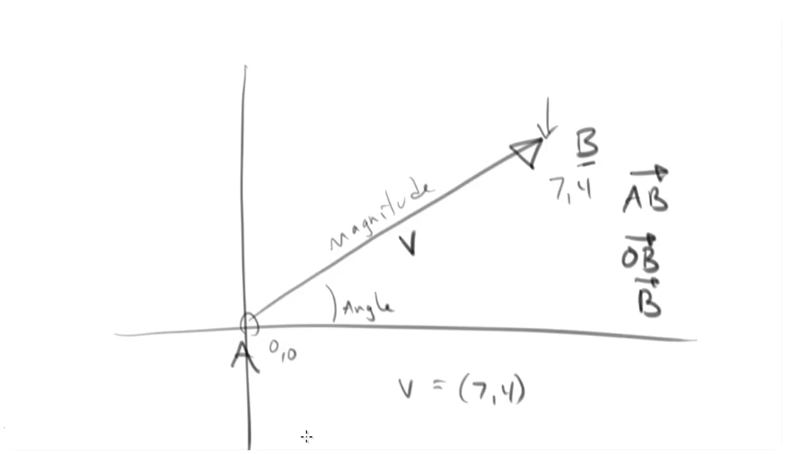
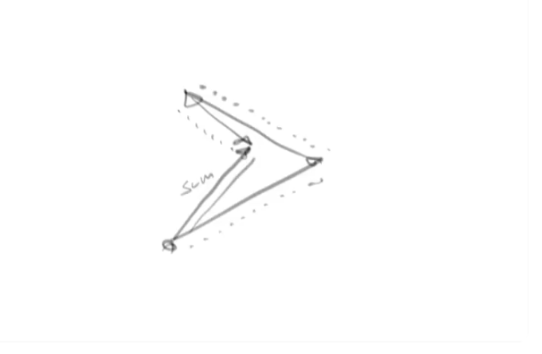
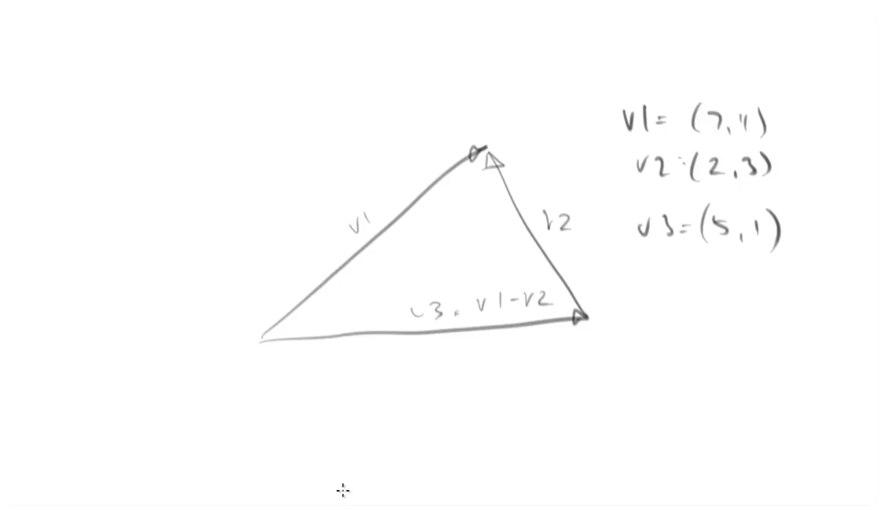
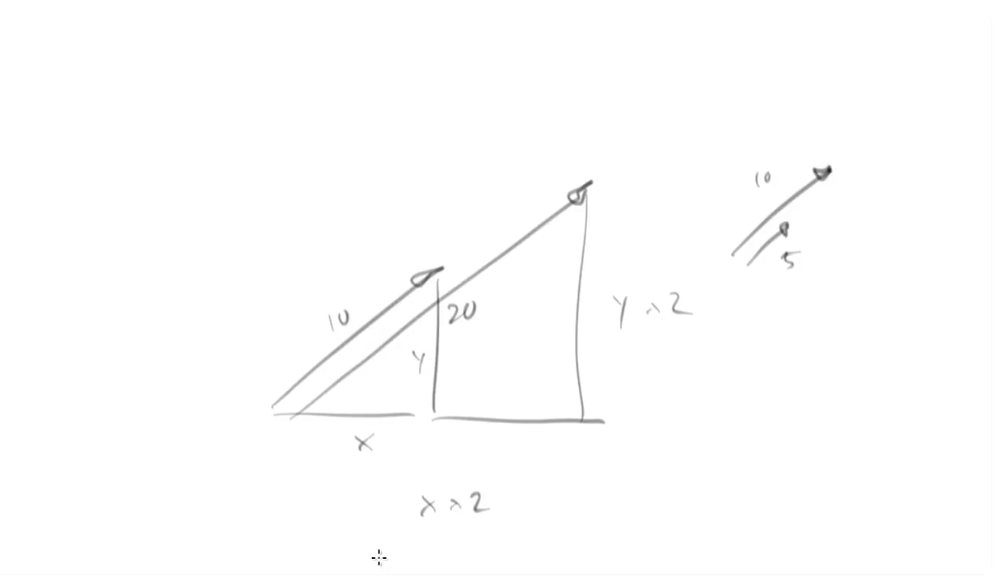
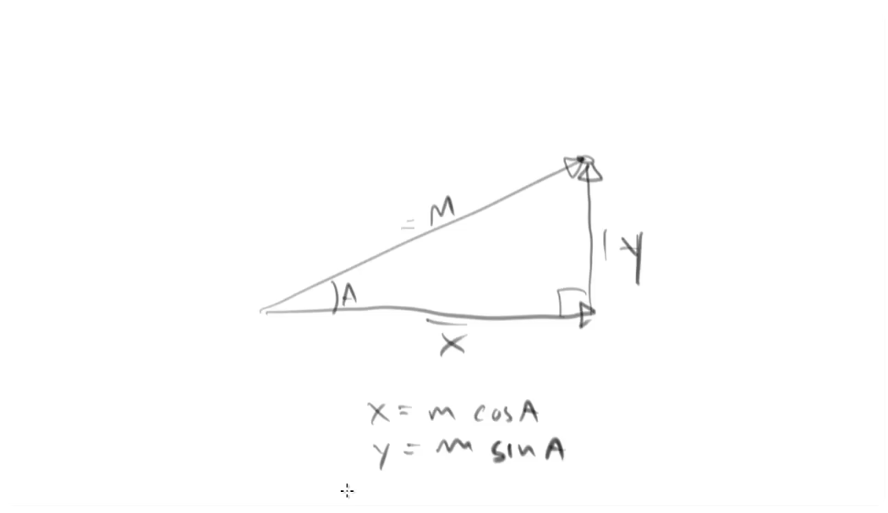

# Vectors

Lesson videos:
- https://youtu.be/DfGOw8_ZaBA
- https://youtu.be/zYOGtlY6xaM

## Introduction

Vector is an entity that encapsulates a direction and a magnitude. Usually it's represented as an arrow. End of the vector is called the tail, and the beginning is called the head.

The direction is the angle of the vector. The magnitude is the length of the vector.

Vectors usually displayed as AB with an arrow on top, where A is the tail and B is the head. If the tail of the vector is the origin (0, 0), then the vector can be displayed as 0B or just B.

Another, more common, way to specify a vector is to use (x,y) coordinates of the vector's head. If point B is positioned at (7,4) you can call it V = (7,4).

## Vectors applications

Vectors can be used to represent many things, like:
- Position (magnitude is distance)
- Velocity (magnitude is speed, direction is the direction of the movement)
- Force (magnitude is force, direction is the direction of the force)
- Acceleration (magnitude is acceleration, direction is the direction of the acceleration)

## Operations with vectors

### Adding vectors

To add vectors, we simply add them head to tail in any order. And then we draw a vector from the first tail to the last head.

So it we go in one direction, then in another and then in the third direction, and then we draw a vector from the first tail to the last head, we will
get the same result as the sum of all the vectors (because we end up in the same position).

Order doesn't matter, because the result is always the same.

- V1 = (7,4)
- V2 = (2,3)
- V3 = V1 + V2 = (9,7)

The same goes not only for positions, but also for forces.

### Subtracting vectors

To subtract vectors, position the heads of the vectors together, and then draw a vectors from the tail of the first vectors to the tail of the second.

- V1 = (7,4)
- V2 = (2,3)
- V3 = V1 - V2 = (5,1)

### Multiplying vectors

There are two ways to multiply vectors:
- Multiplication of vectors by other vectors. This results in operations we call "dot product" and "cross product".
- Simpler form – scalar multiplication. Multiplying a vector by a single scalar value. Scalar value is a simple number like 1, -2, 3.14, etc.

In scalar multiplication, what we're multiplying is the length (or magnitude) of the vector. So if a vector has length 10, and we multiply it by 2, the result will be a vector with length 20. The angle stays the same.

If we represent a vector as (x,y), then we multiply each of these values by scalar.

### Dividing vectors

Division of vectors has the same concept as scalar multiplication – dividing the length of the vector by a scalar value gives us the length of a new vector (e.g. 10 / 2 = 5).

## Another vector's representation

As we already know, vectors can be represented as magnitude and direction or as (x,y) coordinates. Knowing how to add vectors, we can represent (x,y) vector as a sum of two vectors – one in the x-axis and one in the y-axis. The sum of these two vectors will give us the original vector. And the length of the X vector will be the x-coordinate of the original vector (and the length of Y is the y-coordinate).

We may notice that these two vectors form a right triangle. The hypotenuse is the original vector, the adjacent side is the X vector, and the opposite side is the Y vector.

- x = magnitude * cos(angle)
- y = magnitude * sin(angle)

Likewise, if we know x and y we can find the angle of the original vector with arctan(y / x). Then we can use the Pythagorean theorem to find the length.

