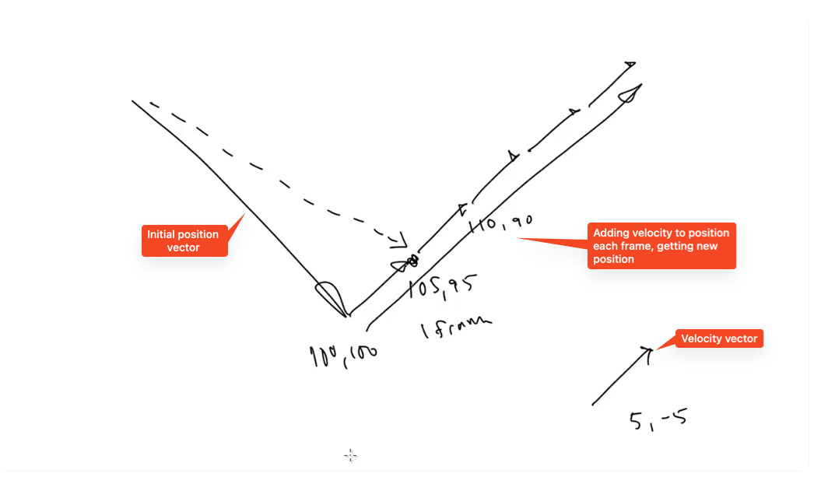

# Velocity

Lesson video: https://youtu.be/IpN4NLDpWDY

Velocity consist of two things: speed and direction. Magnitude is the speed. 

Speed will be represented by a number, but in what units – m/s, km/h, px/frame ...? We will choose px/frame, since we're animating frame by frame. Keep in mind, that frame is arbitary unit of time that will vary depending of how good the computer is, how optimized the code is, etc. In the future lessons we will learn how to program velocity as pixels per second, so that animations will always run at the same speed.

Speed itself has two factors: distance and time.

## Using velocity to change position

This figure above represents change of position by adding velocity to it. The biggest vector represents the initial position of an object (say it's 100,100). The smaller vector at the bottom right corner represents the velocity (say it's 5,-5). We add the velocity vector to the position vector and that gives us a new position (105,95). It represents the position exactly after 1 frame. The next frame we add the velocity vector to the new position and that gives us a new position (110,90). And so on and so on, we get a motion of the object.
