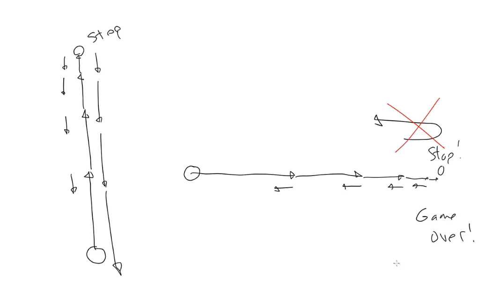

# Friction

Lesson video: https://youtu.be/ueqi8boYS5k

Today we will discuss theory of friction and a couple of ways to implement it – one is generally correct (from the physics viewpoint) and another is totally wrong (but good enought for most applications).

## What is friction

There are a bunch of different types of friction:
- Dry
- Fluid
- Lubricated
- Skin
- Internal

In this lesson we will cover dry friction (two surfaces in contact), and skin friction (occurs when an object moves through a liquid or some other medium like atmosphere). Skin friction is also a part of "drag".

## Friction vectors

We know that if we're moving along a certain speed and encounter some friction, it will slow us down. In other words, it will change our speed. And we know that speed is one component of velocity, so friction is something that changes velocity. And hey, that's the definition of acceleration! So yes, friction is a force vector that can be used just like acceleration vector.

In real life the friction can be very complex and depend on a lot of factors (materials, medium, surface area, shape, weight, slope, tempreture, etc.). For our purposes, we're going to simplify it and create a single vector whose direction is an opposite of the velocity vector of an object.

Now it may seem stange to imagine friction as a force that actively pushing something in the opposite direction. We tend to think of it as more of a passive resistance. But **Newton's third law** says that for every action, there's an equal and opposite reaction.

We know the direction of a friction vector, but what about the magnitude? As we described earlier, there are many factors that affect friction (we can research about them on internet), but for most games or non-scientific simulations we're probably going to come up with some number that makes animation look "right". In our simulations we will do a major simplification and say that an object's velocity will have no effect on the amount of friction being applied.

## Friction reversal

There's one interesting fact about friction as compared to other acceleration vectors. If we throw a ball in the air, the gravity vector will gradually decrease its velocity (speed) until it reaches 0 and then it will change the direction of the velocity vector, increasing its speed in the opposite direction (the ball will start falling down).

But friction will never reverse the direction. If we slide an object across a surface, the friction vector will decrease the velocity vector magnitude until it reaches 0 and **then it stops**. Friction never reverse the direction of the velocity vector. 

But if we have a friction vector that has a bigger magnitude than a velocity vector, then it's going to reverse its direction. We must be careful with this and never let this happen.

