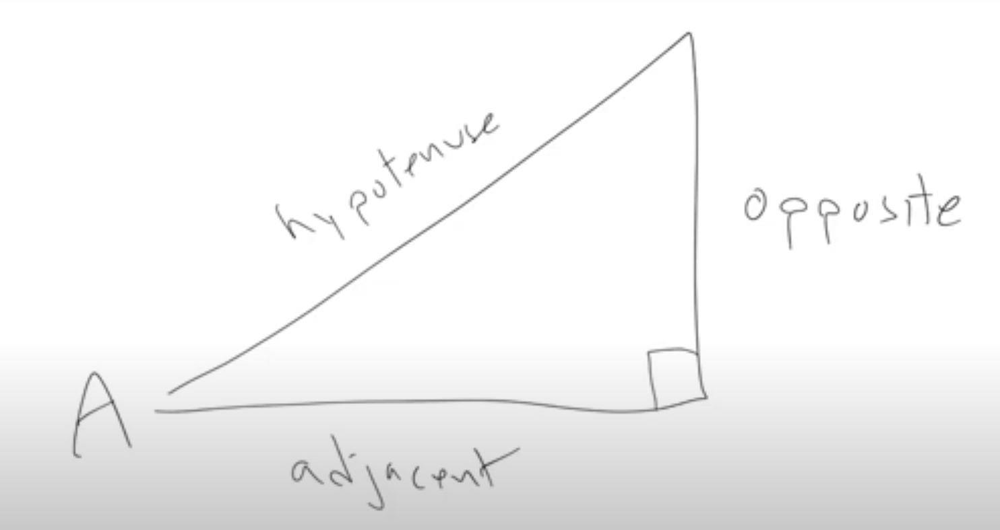
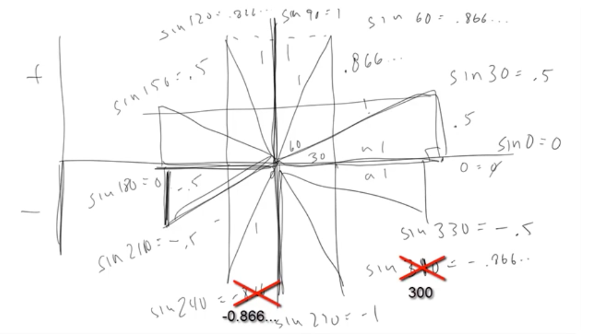
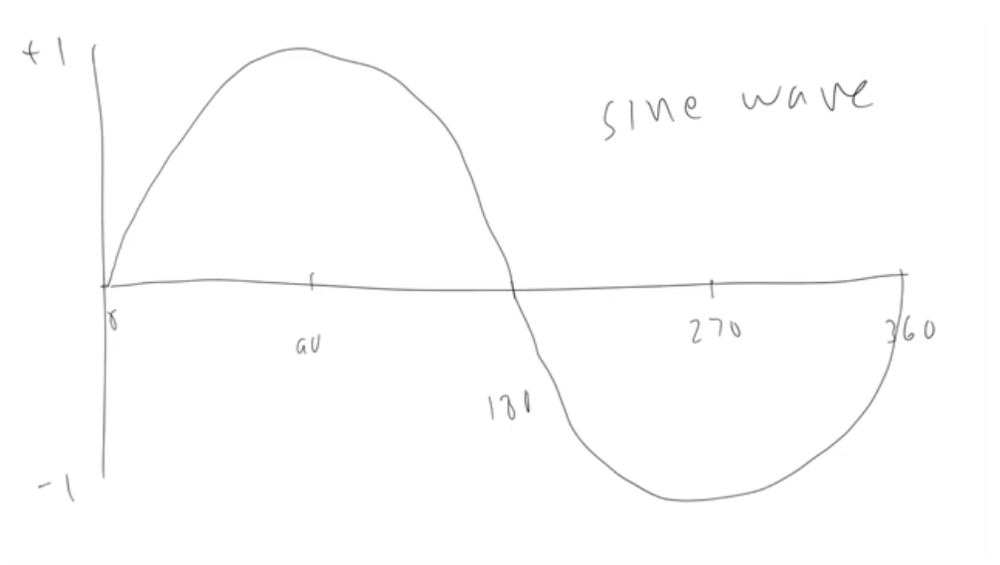
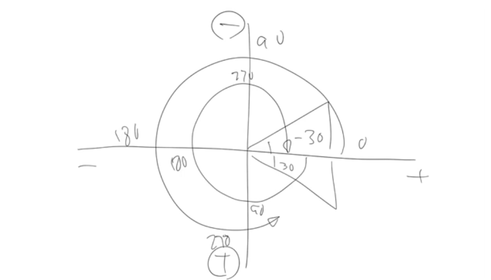
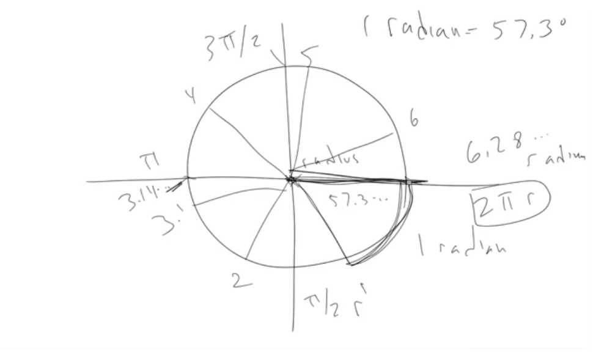

# Intro to Trigonometry

Lesson video: https://youtu.be/yAHl_kpqr-k

Trigonometry is the study of triangles. Study between the angles and sides of a triangle.

## Right Triangles

A right triangle is a triangle with one angle equal to 90 degrees. Hypotenuse is the longest side of the triangle. The opposite side is the side opposite the angle A. The adjacent side is the side adjacent to the angle A.

sin(A) = opposite / hypotenuse
cos(A) = adjacent / hypotenuse
tan(A) = opposite / adjacent

sin/cos/tan give us a number between 0 and 1. They are all a ratio of the sides of the triangle.

## Angles example

Let's say hypotenuse always equals 1. 
- Then for degree 0, opposite equals 0 and adjacent equals 1 (sin(0) = 0, cos(0) = 1).
- For degree 30, opposite equals 0.5 and adjacent equals 0.866 (sin(30) = 0.5, cos(30) = 0.866).
- For degree 60, opposite equals 0.866 and adjacent equals 0.5 (sin(60) = 0.866, cos(60) = 0.5).
- For degree 90, opposite equals 1 and adjacent equals 0 (sin(90) = 1, cos(90) = 0).
- For degree 120, opposite equals 0.866 and adjacent equals -0.5 (sin(120) = 0.866, cos(120) = -0.5). This is the same as degree 60, but the opposite is negative.
- Etc.

## Sine Wave

The sine wave is a wave that oscillates between 0 and 1. It is a periodic function that repeats itself every 360 degrees. It's like a representation of the circle on a graph where the y-axis is the sine of the angle and the x-axis is the angle.

## Coordinates system

Usually we use a coordinates system, where the right side is positive x and the top side is positive y (and vice versa for the left and bottom sides). It's also called the Cartesian coordinate system.

But on a lot of computer systems, we use a coordinates system where the bottom side is positive y and the top side is negative y. This is due to historical reasons relating to rendering on screens.

So on Web Canvas, the top left corner is the (0, 0) point. And the angles go counter-clockwise (30 degree is "below" x-axis, -30 degree is "above" x-axis).

## Radians

1 radian equals roughly 57.2958 degrees. Why so? Imagine we have a graph with a circle with radius 1 (distance from the center to the edge of the circle). Imagine we have a string with the length of the radius. Then if we place it around the circle and then measure the angle, we will get 57.2958 degrees.

If we continue to place this string on the circle we will get 2 radians, 3 radians, THEN 3.14 radians (PI) which is also 180 degrees. And so on. It's just a convenient way to measure the angles of the circle.

- 90 degrees is equal to π/2 radians.
- 180 degrees is equal to π radians.
- 270 degrees is equal to 3π/2 radians.
- 360 degrees is equal to 2π radians.

To convert degrees to radians – degree * π / 180.
To convert radians to degrees – radians * 180 / π.

