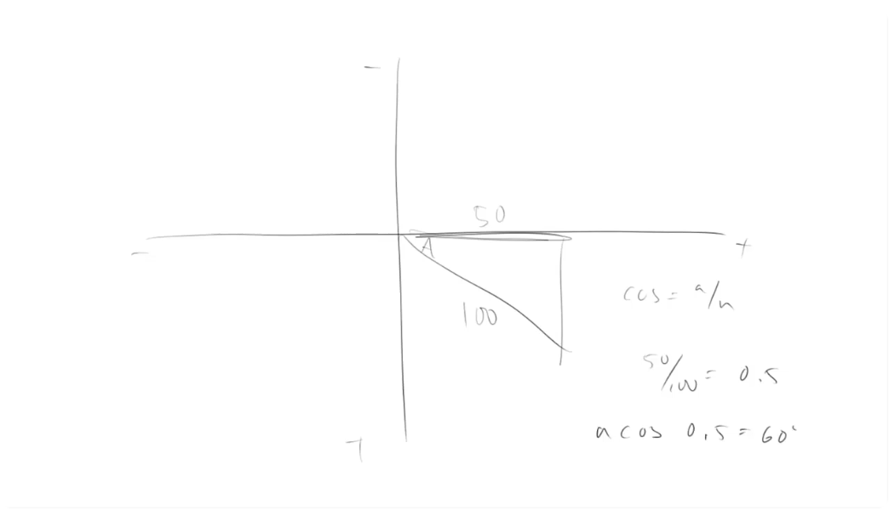
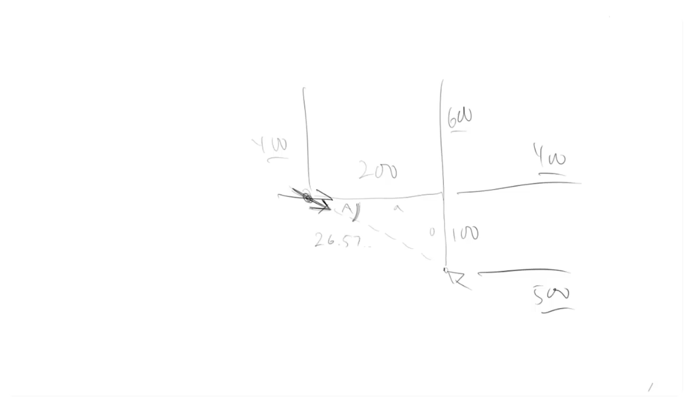
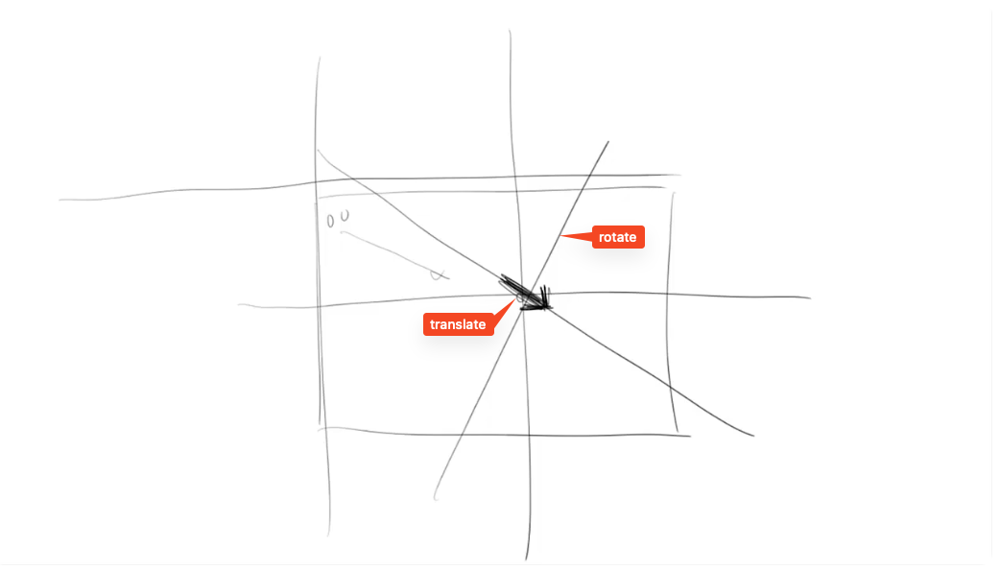

# Arctangent

Lesson video: https://youtu.be/LHzgW9aQUV8

From programming perspective, values that we can get from the **tangent** can approach Infinity or -Infinity, and can be even undefined for a certain values. So even if this curve can be useful sometimes, dealing with this values can be messy.

However, there is a related function that can help us with this: **arctangent**. This function can help us with graphics, animations and even interactivity.

## Inverse functions

**Arctangent** (**atan**) is the inverse of **tangent**. There's also **arcsine** and **arccosine**, that are inverses of **sine** and **cosine** respectively (often abbreviated as **asin** and **acos**). Sometimes these function can be written as **sin⁻¹**, **cos⁻¹**, **tan⁻¹**.

What do we mean by "inverse"? Say we have a sin(30°) which equals 0.5. That simply means that asin(0.5) equals 30°.

**acos** and **asin** will come in handy now and then, but **atan** will be especially useful for us.

## Example of acos()

Let's say we have a right triangle with hypotenuse 100 units long and one side equals 50 units long. We need to find the angle of A. For angle A that side that 50 units long is the adjacent side. We know, that to find the length of the opposite side we need to divide the adjacent side by the hypotenuse. 50 / 100 = 0.5. Knowing that, we can find the angle of A by using acos(0.5), which gives us 60°.

## Example of atan()

Say we have an arrow and a mouse cursor. We want to point that arrow to the current position of the mouse cursor. How do we do this?

The arrow is positioned at 400 on Y axis and 400 of Y axis, the mouse cursor is at 600 on Y axis and 500 on Y axis. We can "draw" a right triangle between these two points, we need to find the value of angle A. The distance between the two is 200 on the Y axis (600 - 400) and 100 on the Y axis (500 - 400). So now we know the length of the opposite side and the adjacent side. 

Which function is the ration between the opposite and the adjacent side? That's right, **tan**! So we can get the ratio between these two sides, pass it to **atan** and get the angle to rotate the arrow.

The ratio is 0.5 (100 / 200). So atan(0.5) gives us 26.565°. 

Now let's code this up! But first...

## Canvas transformations

We need to go over the canvas transformation. There are two ways to implement this "arrow - mouse cursor" scenario. We can either use math to calculate the rotation of the arrow or we can translate and rotate the canvas. We will go with the latter.

First we want to translate the drawing context to move the "0, 0" (the origin) to the point where we want to draw the arrow. 

Next we call context.rotate(), passing an angle and a radius. This does not actually rotate the canvas, but rotates the coordinates system.

The order of these operations is important – first translate, then rotate.

We will be doing it over and over again repeatedly, with different rotation angles and possibly different positions for the arrow. So to keep things clean we will save the untransformed context, do our transformations, do the drawing and then restore the context back to its original state.