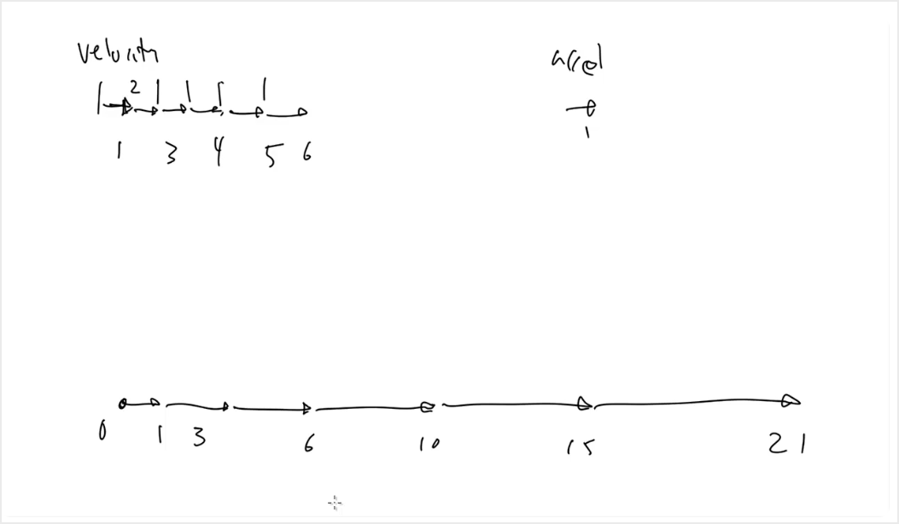
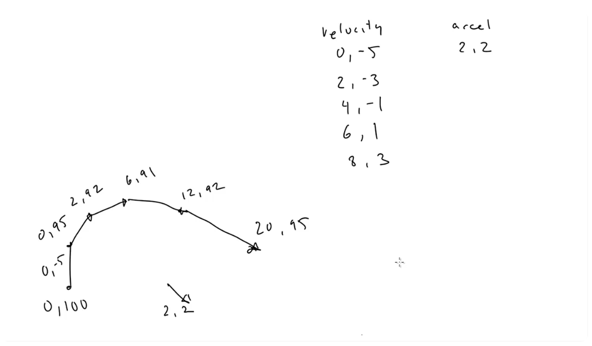

# Acceleration

Lesson video: https://youtu.be/OuzWDQ6zFXo

In the previous lesson we learned that velocity is **change of position** over time. It's represented by a vector, that has magnitude (speed) and direction (angle).

Acceleration is **change of velocity** over time. It's also represented by a vector, also has a direction and magnitude.

Sometimes there might be confusion about the "acceleration" term. There are different meanings of this term in different contexts. In common every day use acceleration usually mean speeding up (e.g. car accelerating). But in physics world, acceleration means change of velocity over time (speeding up, slowing down, changing directions).

To know how to program realistic physics we need to understand and use acceleration. There are many examples where it can be applied: a car gradually accelerating from 0 to 50 km/h (not just start from 50 km/h) or slowing down to 0 km/h, a projectile (like a ball) flying in the air and changing its direction, etc.

## First example of acceleration

To keep things simple we will use the X direction only. Our object starts at position (0,0), velocity is 1 (angle 0), acceleration is also 1 (angle 0). 

First we add velocity to position, resulting in (1,0). Then we add acceleration to velocity, not it's equal 2. The next frame adding velocity to positiong gives us (3,0), the object is accelerating. We continue doing this every frame, making object move faster and faster every frame.

## Units of acceleration

As we know, velocity is distance over time (dist/time). Acceleration is the change of velocity over time, so it's in terms of distance per time per time (dist/time/time).

For example, gravity is a type of acceleration. Its magnitute is about 32 feet per second per second (ft/s^2) or 9.8 meters per second per second (m/s^2). If an object is stationary and has a velocity of 0, if it's then dropped,  it's velocity will be 9.8 m/s after 1 second, 19.6 m/s after 2 seconds, 29.4 m/s after 3 seconds, etc. So gravity increases the velocity by 9.8 m/s every second.

## Second example of acceleration

Let's use two dimensions now. Our object start at (0,100) and its initial velocity is (0,-5), so it's going to move straight up on the screen. The acceleration vector is going to be (2,2), so it's pulling the object down and to the right. First frame object winds up at (0,95), velocity changes to (2,-3). On the next frame, it puts an object at (2,92), velocity changes to (4,-1). And so on.

So as we can see, the acceleration changes not only speed of the object, but also its direction. The way acceleration works in general is that some force acting on an object to change its velocity. AN object that moves at a certain velocity will tend to mantain this velocity unless some force is acting on it.

So in this example the force is acting on the object, maybe it's a person pulling the rope, a rocket engine, or even the gravity of a planet.

This method of adding acceleration to velocity and then velocity to position is called **Euler's method**. And it's what's known as a **mathematical integration**. It's a simple and effective way to simulate physics, but it's not the most accurate – the bigger steps we take, the less accurate the **Euler's method** is. In the later lesson we will learn about more accurate methods of integration.
